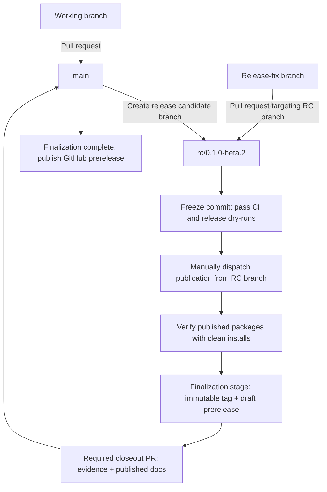

# Contributing to agent-topology

Thank you for helping improve the 0.1 public preview. The contract is provisional:
changes should preserve honest uncertainty and avoid presenting the current
LangGraph-shaped evidence as vendor neutrality or v1 stability.

## Before opening a change

- Use GitHub Issues for reproducible bugs, compatibility evidence, and focused
  proposals. Public support is best-effort; the project makes no response-time or
  long-term-support commitment.
- Report suspected vulnerabilities privately as described in
  [SECURITY.md](SECURITY.md), not in a public issue.
- Read [ARCHITECTURE.md](ARCHITECTURE.md), [CONVENTIONS.md](CONVENTIONS.md), and the
  [decision router](docs/decisions/DECISIONS.md). A material boundary change needs
  an ADR rather than an undocumented convention.

Keep fixtures to the minimum graph that measures one contract behavior. Core fields
must remain framework-neutral in shape; producer-specific facts belong under a
namespaced `x-*` extension. Tests must preserve the distinction between producer
limitations and graph-specific gaps, as well as canonical output and hashing.

## Development checks

For environment setup and a complete local check sequence, see
[local development](docs/maintainers/development.md). Public user guides start at
the [documentation home](docs/README.md).

The authoritative commands and pinned tool versions live in
[CONVENTIONS.md](CONVENTIONS.md#tests-and-conformance). Run the checks for every
package you change. Changes to packaging, compatibility, or release behavior also
require artifact inspection and clean-install smoke tests.

Pull requests should explain the observable change, its verification, and any
compatibility impact. By contributing, you agree that your contribution is licensed
under the repository's [MIT License](LICENSE).

## Branching strategy

`rc` stands for release candidate. `main` is the integration branch. Merge normal
development from working branches through pull requests. When a release is ready
for stabilization, create
`rc/<version>` from the reviewed main commit, for example
`rc/0.1.0-beta.2`.

- Keep version preparation, release notes, and candidate fixes on the release
  branch. Target release-fix PRs at that branch; keep unrelated development on main.
- There is no separate branch named `release`. Each release uses its own
  `rc/<version>` branch.
- PR merges approve code; they do **not** automatically publish packages or create
  tags. Publication is a separate, manually triggered workflow after qualification.
- Freeze the candidate commit during qualification and publication. Any source
  change requires fresh qualification. Create the immutable version tag on the
  qualified commit only after publication and registry-install verification succeed.
- After registry publication, stage the immutable tag and draft prerelease, then
  merge a dedicated closeout PR that records evidence and updates public installation
  documentation. Publish the GitHub prerelease only after the closeout check passes on
  main; retain the RC branch as the preparation record.

## Releases

The four packages are independently versioned and published. Do not infer a package
version from the topology format, the hash algorithm, or another package. Maintainers
must use the protected workflows and follow the
[release and partial-publication recovery guide](docs/releasing.md); publishing one
artifact is not authority to announce the coordinated preview.
